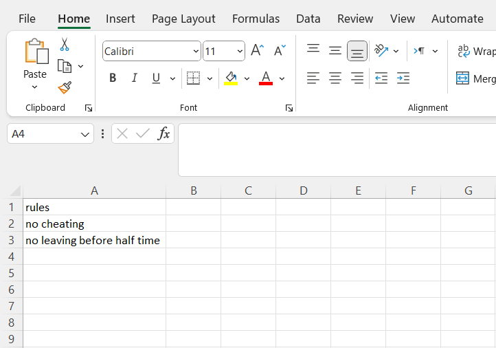
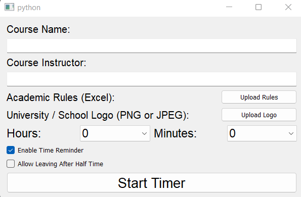
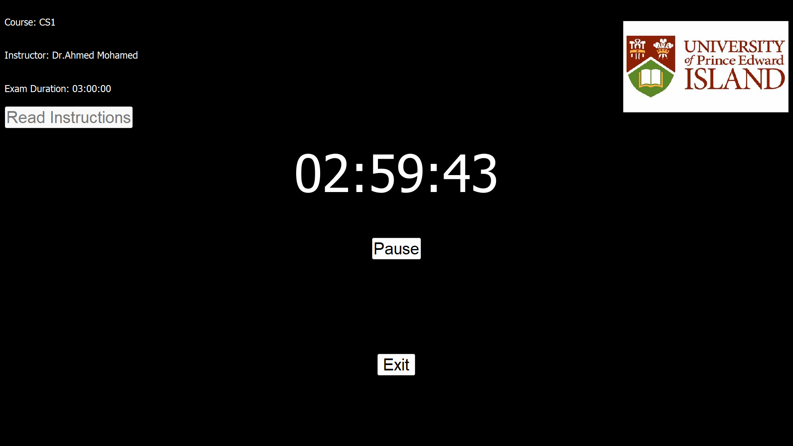

# Exam Timer app using PyQt5
This is a simple app for Academic Staff who have exam proctoring sessions. The app is built using pyqt5 where the user can enter his institution logo, course name, course instructor, exam duration, exam instructions and can enable or disable voice alerts (which are using gtts library for text to speech function).

## Installation

There are two ways for installation. first you can navigate to the project folder and type the following commands : - 
```bash
pip install -r requirements.txt
python main.py
```
or you can download the installer from the following link: 
[download installer](https://www.mediafire.com/file/yw2sztho36irakm/timer.exe/file)


## Screenshots
exam rules needs to be uploaded in Excel file and under a column named rules like the following screenshot:






## License

[MIT](./LICENSE)